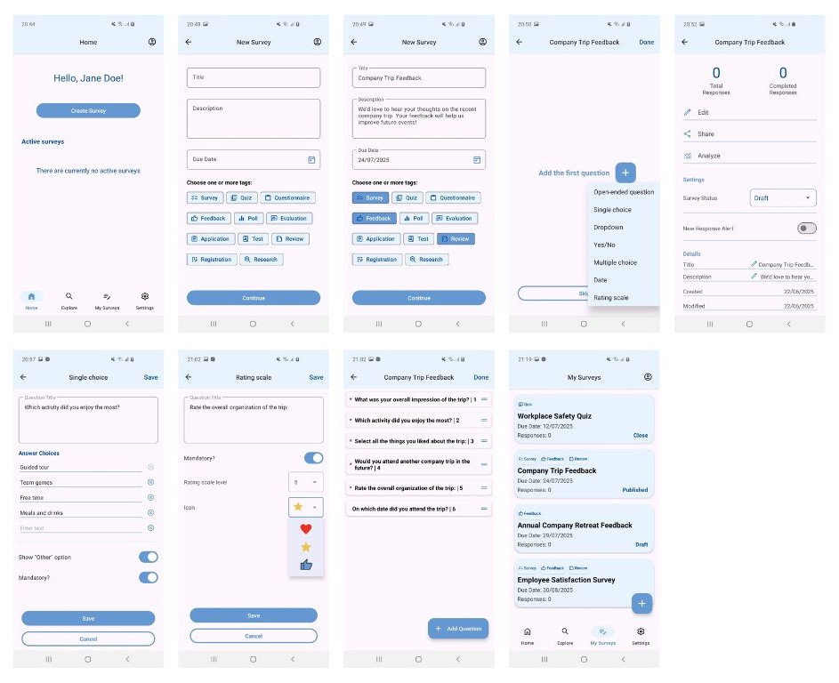
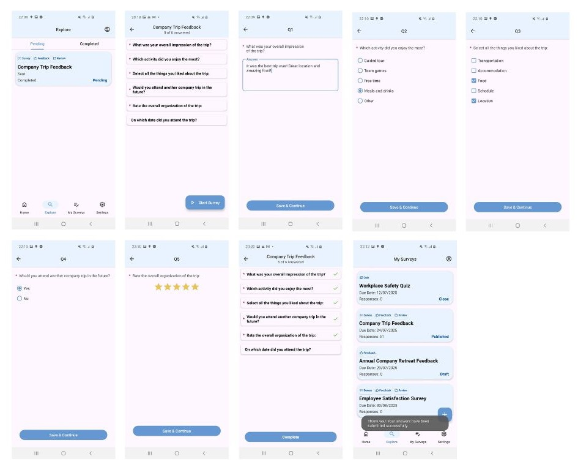
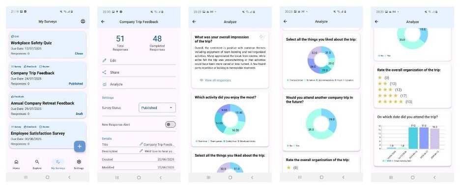

# 📋 Questionnaire Builder – Android App

Final project for a bachelor's degree in software engineering, in Afeka - the academic college of Engineering in Tel-Aviv.


---

## 🧩 Project Overview

**Questionnaire Builder** is a user-friendly Android app designed to streamline the entire survey lifecycle - from creation to distribution and response analysis - in one unified platform.

The app supports various question types (open-ended, multiple choice, rating, date, and more), QR and deep link sharing, real-time participation, and built-in analytics with dynamic charts and AI-powered summaries.


---

## 📱 Features

### 👥 User Authentication
- Firebase Authentication (email & password)
- Registration and secure login
- Persistent session handling
- User profile image upload and display (via Firebase Storage)

### 💼 Survey Management
- Create surveys with:
    - Title, description, and due date
    - Up to 3 tags (e.g., Survey, Quiz, Questionnaire)
    - Draft/Published/Closed status
- Manage survey's questions in a visual list
- View total responses, creation/modification dates, and sharing options

### 📝 Questions
- Multiple supported types:
    - Open-ended
    - Single Choice / Multiple Choice
    - Yes/No
    - Rating (stars/hearts/thumb-ups)
    - Dropdown
    - Date picker
- Each question is configurable
- Drag-and-drop ordering of questions

### 🔗 Sharing
- Generate Android App Links for survey access
- Generate and scan QR codes
- Non-logged-in users redirected to Welcome/Login → then deep-linked to the survey
- SurveyResponseStatus documents track respondent progress (`PENDING`, `COMPLETED`)

### 🔍 Explore Screen

- Divided into two tabs:
    - **Pending** – surveys not yet completed
    - **Completed** – surveys already submitted
- Each survey card shows:
    - Title
    - Tags (e.g., Feedback, Quiz)
    - Status indicator (Pending/Completed)
    - Sent and completed dates
- Surveys shared via link or QR code appear in the Pending tab after accessing the link
- Selecting a survey opens the question screen

### 📊 Response Analysis
- Graphs using MPAndroidChart:
    - Pie (Single Choice, Yes/No)
    - Bar (Rating, Dropdown)
    - Line (Date)
- Open-ended AI-powered summary with Gemini (Firebase AI Logic) up to 50 words
- View full response list or summary per question

<br>

---
## 🧱 Technology Stack

| Layer        | Technology                                              |
|--------------|---------------------------------------------------------|
| Frontend     | Java (Android SDK), XML Layouts                         |
| Backend      | Firebase (Authentication, Firestore, Storage, Logic AI) |
| Database     | Firebase Firestore (Cloud NoSQL)                        |
| Architecture | Client-Server, Modular Components                       |

<br>

## 🧰 Tools & Libraries

| Tool/Library        | Purpose                             |
|---------------------|-------------------------------------|
| Firebase Auth       | Login & registration                |
| Firestore           | Store surveys, questions, responses |
| Firebase Storage    | Profile picture upload              |
| Logic AI (Gemini)   | Summarize open responses (optional) |
| MPAndroidChart      | Data visualization                  |
| Glide               | Load and cache user images          |
| Material Components | Modern Android UI                   |
| Grafana Loki        | Store logs                          |

<br>

---

## ▶️ How to Use

### ✏️ Creating a Survey

1. **Log in** or **sign up** with your email and password
2. Tap **Create New Survey**
3. Enter survey details:
    - Title, description, and due date
    - Up to **3 tags** (e.g., Survey, Quiz, Feedback)
4. Add questions using supported types (Open-ended, Single/Multiple Choice, Yes/No, Rating, Date, Dropdown)
5. Choose to **Publish** the survey or **Save as Draft**
6. Share your survey via:
    - Android App Link
    - QR Code (automatically generated)



---

### 📝 Responding to a Survey

1. Access the survey using a shared **link** or **QR code**
2. If not logged in, you’ll be prompted to **sign in or register**
3. The survey will appear under the **Pending** tab in the **Explore** screen
4. Answer the questions and **submit** your response
5. After submission, the survey moves to the **Completed** tab



---

### 📊 Analyzing Results

1. Open the **My Surveys** screen and select your survey
2. Tap **Analyze** to view response data
3. Visual summaries are shown (pie, bar, or line charts depending on question type)
4. Open-ended answers are summarized using **Gemini AI** (up to 50 words)



> 🔐 Only authenticated users can create or respond to surveys.

<br>

---

## 📌 Code Snippets

#### 1. Create a link and QR code for a survey

_SurveyManagementActivity.java_

```java

private void setUpShareClick() {
        management_LL_share.setOnClickListener(v -> {
            if (survey.getStatus() == Survey.SurveyStatus.Published) {
                String surveyId = survey.getID();
                String surveyLink = "https://questionnairebuilder-7b883.web.app/survey?id=" + surveyId;

                View dialogView = LayoutInflater.from(this).inflate(R.layout.dialog_share_survey, null);
                ShapeableImageView qrImageView = dialogView.findViewById(R.id.share_qr_image);
                MaterialTextView linkTextView = dialogView.findViewById(R.id.share_link_text);
                AppCompatImageButton copyButton = dialogView.findViewById(R.id.share_copy_button);
                linkTextView.setText(survey.getSurveyTitle());
                linkTextView.setTextColor(ContextCompat.getColor(this, android.R.color.holo_blue_dark));
                linkTextView.setPaintFlags(linkTextView.getPaintFlags() | Paint.UNDERLINE_TEXT_FLAG);
                linkTextView.setOnClickListener(v2 -> {
                    Intent browserIntent = new Intent(Intent.ACTION_VIEW, Uri.parse(surveyLink));
                    startActivity(browserIntent);
                });

                // Handle copy button click
                copyButton.setOnClickListener(v1 -> {
                    android.content.ClipboardManager clipboard = (android.content.ClipboardManager) getSystemService(CLIPBOARD_SERVICE);
                    android.content.ClipData clip = android.content.ClipData.newPlainText("Survey Link", surveyLink);
                    clipboard.setPrimaryClip(clip);
                    Toast.makeText(this, "Link copied to clipboard", LENGTH_SHORT).show();
                });

                // Generate QR Code
                try {
                    BarcodeEncoder barcodeEncoder = new BarcodeEncoder();
                    Bitmap bitmap = barcodeEncoder.encodeBitmap(surveyLink, BarcodeFormat.QR_CODE, 400, 400);
                    qrImageView.setImageBitmap(bitmap);
                } catch (Exception e) {
                    Toast.makeText(this, "Failed to generate QR code", LENGTH_SHORT).show();
                    return;
                }

                // Build dialog
                new AlertDialog.Builder(this)
                        .setView(dialogView)
                        .setCancelable(true)
                        .setNegativeButton("Close", (dialog, which) -> dialog.dismiss())
                        .show();
            } else {
                Toast.makeText(getApplicationContext(), "Survey not shared. Set status to 'Published' and click 'Save'.", LENGTH_LONG).show();
            }
        });
    }
    
```

#### 2. Load Responses of the survey for a user

_QuestionsActivity.java (response mode)_

```java

private void fetchUserResponses() {
    FirestoreManager.getInstance().getUserResponsesForSurvey(surveyID, currentUserId, new ResponsesCallback() {
        @Override
        public void onResponsesLoaded(Map<String, Boolean> answeredQuestions) {
            answeredCount = answeredQuestions.size();
            answeredMandatoryCount = (int) answeredQuestions.values().stream()
                    .filter(Boolean.TRUE::equals)
                    .count();
            String questionsProgress = getString(R.string.survey_responses_subtitle, Objects.requireNonNullElse(answeredCount, 0), Objects.requireNonNullElse(totalCount, 0));
            runOnUiThread(() -> {
                questionsAdapter.setAnsweredQuestionIds(answeredQuestions.keySet());
                toolbar.setSubtitle(questionsProgress);
                if (answeredCount == 0) {
                    questions_FAB_start.setText(getString(R.string.start_survey));
                    questions_FAB_start.setIconResource(R.drawable.ic_start);
                } else {
                    if (answeredMandatoryCount == totalMandatoryCount /*answeredCount == totalCount || (answeredCount >= totalMandatoryCount && answeredCount > 0)*/) {
                        if (surveyResponseStatus == null || surveyResponseStatus.getStatus() != SurveyResponseStatus.ResponseStatus.COMPLETED) {
                            questions_BTN_complete.setVisibility(VISIBLE);
                            questions_LBL_completed.setVisibility(GONE);
                        } else {
                            questions_BTN_complete.setVisibility(GONE);
                            questions_LBL_completed.setText(formatDateTime(surveyResponseStatus.getCompletedAt()));
                            questions_LBL_completed.setVisibility(VISIBLE);
                        }
                        adjustRecyclerViewPadding();
                    } else {
                        questions_FAB_start.setText(getString(R.string.continue_survey));
                        questions_FAB_start.setIconResource(R.drawable.ic_resume);
                        questions_BTN_complete.setVisibility(GONE);
                        questions_LBL_completed.setVisibility(GONE);
                    }
                }
                if (questionsList.isEmpty() || (answeredMandatoryCount == totalMandatoryCount && answeredCount > 0)/*answeredCount == totalCount*/)
                    questions_FAB_start.setVisibility(GONE);
                else
                    questions_FAB_start.setVisibility(VISIBLE);
            });
        }

        @Override
        public void onError(Exception e) {
            Log.e("QuestionsActivity", "Failed to load user responses", e);
        }
    });
}

```

_FirestoreManager.java_

```java

public void getUserResponsesForSurvey(String surveyId, String userId, ResponsesCallback callback) {
        responsesRef.whereEqualTo("surveyID", surveyId)
                .whereEqualTo("userID", userId)
                .get()
                .addOnSuccessListener(queryDocumentSnapshots -> {
                    Map<String, Boolean> answeredQuestions = new HashMap<>();
                    for (DocumentSnapshot doc : queryDocumentSnapshots) {
                        String questionID = doc.getString("questionID");
                        Boolean isMandatory = doc.getBoolean("mandatory");
                        if (questionID != null && isMandatory != null) {
                            answeredQuestions.put(questionID, isMandatory);
                        }
                    }

                    GrafanaLogger.info("FirestoreManager", "Responses loaded for surveyId: " + surveyId + " and userId: " + userId);

                    if (callback != null) {
                        callback.onResponsesLoaded(answeredQuestions);
                    }
                })
                .addOnFailureListener(e -> {
                    try {
                        JSONObject errLog = new JSONObject();
                        errLog.put("surveyId", surveyId);
                        errLog.put("userId", userId);
                        errLog.put("error", e.getMessage());
                        GrafanaLogger.error("FirestoreManager", "Failed to fetch responses for survey: " + surveyId + " for user Id: " + userId, errLog);
                    } catch (Exception ex) {
                        GrafanaLogger.error("FirestoreManager", "Failed to log error JSON");
                    }

                    if (callback != null)
                        callback.onError(e);
                });
    }

```

#### 3. Display user's pending and completed surveys

_ExploreFragment.java_

```java

private void initTabs() {
        // Add tabs
        tabLayout.addTab(tabLayout.newTab().setText(getString(R.string.pending)));
        tabLayout.addTab(tabLayout.newTab().setText(getString(R.string.completed)));

        // Select the correct tab immediately after adding them
        TabLayout.Tab initialTab = tabLayout.getTabAt(selectedTabPosition);
        if (initialTab != null) {
            initialTab.select(); // This triggers onTabSelected
        }

        tabLayout.addOnTabSelectedListener(new TabLayout.OnTabSelectedListener() {
            @Override
            public void onTabSelected(TabLayout.Tab tab) {
                selectedTabPosition = tab.getPosition();
                getStatusFromTab(selectedTabPosition);
            }

            @Override
            public void onTabUnselected(TabLayout.Tab tab) {}

            @Override
            public void onTabReselected(TabLayout.Tab tab) {}
        });
    }


private void getStatusFromTab(int selectedTabPosition){
    // Determine status filter based on tab
    if (selectedTabPosition == 0) {
        currentStatusFilter = SurveyResponseStatus.ResponseStatus.PENDING.toString();
    } else if (selectedTabPosition == 1) {
        currentStatusFilter = SurveyResponseStatus.ResponseStatus.COMPLETED.toString();
    }

    viewModel.setStatusFilter(currentStatusFilter); // Trigger filtering in ViewModel
}

private void initSurveysList() {
    viewModel.getFilteredSurveys().observe(getViewLifecycleOwner(), surveysWithResponses  -> {
        surveyAdapter.updateSurveys(surveysWithResponses); // Update UI automatically when LiveData changes
        explore_LBL_noSurveys.setVisibility(surveysWithResponses.isEmpty() ? VISIBLE : GONE);
        hideShimmer();
    });
}

```

_ExploreViewModel.java_

```java

public void startListening() {
    String currentUserId = AuthenticationManager.getInstance().getCurrentUser().getUid();
    listenerRegistration = FirestoreManager.getInstance().listenToSurveyResponseStatuses(currentUserId, new SurveyResponsesStatusCallback() {
        @Override
        public void onResponseStatusesLoaded(List<SurveyResponseStatus> responseStatuses) {
            // Now we have responseStatuses for the current user. Fetch Surveys for these.
            if (responseStatuses.isEmpty()) {
                surveysWithResponsesLiveData.setValue(new ArrayList<>()); // No data
                return;
            }

            List<SurveyWithResponseStatus> combinedList = new ArrayList<>(Collections.nCopies(responseStatuses.size(), null));

            // Counter to check when all survey fetches are done
            final int[] counter = {0};
            for (int i = 0; i < responseStatuses.size(); i++) {
                final int index = i;
                SurveyResponseStatus responseStatus = responseStatuses.get(i);

                FirestoreManager.getInstance().getSurveyById(responseStatus.getSurveyId(), new OneSurveyCallback() {
                    @Override
                    public void onSurveyLoaded(Survey survey) {
                        if (survey != null) {
                            combinedList.set(index, new SurveyWithResponseStatus(survey, responseStatus));
                        }
                        counter[0]++;
                        if (counter[0] == responseStatuses.size()) {
                            // Filter out any nulls (in case some surveys were not found)
                            List<SurveyWithResponseStatus> finalList = new ArrayList<>();
                            for (SurveyWithResponseStatus item : combinedList) {
                                if (item != null) finalList.add(item);
                            }
                            surveysWithResponsesLiveData.setValue(finalList);
                            applyFilter();
                        }
                    }

                    @Override
                    public void onError(Exception e) {
                        counter[0]++;
                        if (counter[0] == responseStatuses.size()) {
                            List<SurveyWithResponseStatus> finalList = new ArrayList<>();
                            for (SurveyWithResponseStatus item : combinedList) {
                                if (item != null) finalList.add(item);
                            }
                            surveysWithResponsesLiveData.setValue(finalList);
                            applyFilter();
                        }
                    }
                });
            }
        }

        @Override
        public void onError(Exception e) {
            // Handle Firestore error
            surveysWithResponsesLiveData.setValue(new ArrayList<>());
        }
    });
}

public void setStatusFilter(String status) {
    this.statusFilter = status;
    applyFilter();
}

private void applyFilter() {
    if (surveysWithResponsesLiveData.getValue() == null) return;
    List<SurveyWithResponseStatus> allSurveys = surveysWithResponsesLiveData.getValue();

    List<SurveyWithResponseStatus> filtered = new ArrayList<>();
    for (SurveyWithResponseStatus item : allSurveys) {
        if (item.getResponseStatus() != null && item.getResponseStatus().getStatus() != null) {
            String status = item.getResponseStatus().getStatus().toString();

            if (statusFilter.equals(SurveyResponseStatus.ResponseStatus.PENDING.toString())) {
                // Show PENDING and IN_PROGRESS when "Pending" tab is selected
                if (status.equals(SurveyResponseStatus.ResponseStatus.PENDING.toString()) ||
                        status.equals(SurveyResponseStatus.ResponseStatus.IN_PROGRESS.toString())) {
                    filtered.add(item);
                }
            } else {
                // Normal filtering for other tabs
                if (status.equals(statusFilter)) {
                    filtered.add(item);
                }
            }
        }
    }
    filteredSurveysLiveData.setValue(filtered);
}

```

_FirestoreManager.java_

```java

public ListenerRegistration listenToSurveyResponseStatuses(String userId, SurveyResponsesStatusCallback callback) {
        return surveyResponseStatusRef.whereEqualTo("userId", userId)
                .orderBy("startedAt", Query.Direction.DESCENDING)
                .addSnapshotListener((querySnapshot, e) -> {
                    if (e != null) {
                        try {
                            JSONObject errLog = new JSONObject();
                            errLog.put("userId", userId);
                            errLog.put("error", e.getMessage());
                            GrafanaLogger.error("FirestoreManager", "Failed to fetch responses status for userId: " + userId, errLog);
                        } catch (Exception ex) {
                            GrafanaLogger.error("FirestoreManager", "Failed to log error JSON");
                        }

                        if (callback != null)
                            callback.onError(e);
                        return;
                    }
                    List<SurveyResponseStatus> list = new ArrayList<>();
                    if (querySnapshot != null) {
                        for (DocumentSnapshot doc : querySnapshot.getDocuments()) {
                            SurveyResponseStatus srs = doc.toObject(SurveyResponseStatus.class);
                            list.add(srs);
                        }
                    }

                    GrafanaLogger.info("FirestoreManager", "Response statuses loaded for userId: " + userId);

                    if (callback != null) {
                        callback.onResponseStatusesLoaded(list);
                    }
                });
    }

```

#### 4. Display user's surveys

_MySurveysFragment.java_

```java

private void initSurveysList(){
    viewModel.getSurveys().observe(getViewLifecycleOwner(), surveys -> {
        surveyAdapter.updateSurveys(surveys); // Update UI automatically when LiveData changes
        mySurveys_LBL_noSurveys.setVisibility(surveys.isEmpty() ? VISIBLE : GONE);
    });
    
    // Observe loading state
    viewModel.getIsLoadingLiveData().observe(getViewLifecycleOwner(), this::showShimmerLoading);
}

```

_MySurveysViewModel.java_

```java

public void startListening() {
        isLoadingLiveData.setValue(true);
        listenerRegistration = FirestoreManager.getInstance().listenToMySurveysWithResponseCount(mCurrentUserId.getValue(),new SurveysWithCountCallback(){

            @Override
            public void onSurveysLoaded(List<SurveyWithResponseCount> surveysWithCount) {
                currentSurveys = new ArrayList<>(surveysWithCount);
                surveysLiveData.setValue(currentSurveys);
                isLoadingLiveData.setValue(false);
            }

            @Override
            public void onSurveyCountUpdated(int position, int count) {
                if (position >= 0 && position < currentSurveys.size()) {
                    currentSurveys.get(position).setResponseCount(count);
                    List<SurveyWithResponseCount> updatedList = new ArrayList<>(currentSurveys);
                    surveysLiveData.setValue(updatedList);
                }
            }

            @Override
            public void onError(Exception e) {
                isLoadingLiveData.setValue(false);
            }
        });
    }

```

_FirestoreManager.java_

```java

public ListenerRegistration listenToMySurveysWithResponseCount(String currentUserId, SurveysWithCountCallback callback) {
        return surveysRef.whereEqualTo("author.uid", currentUserId)
                .orderBy("dueDate")
                .addSnapshotListener((value, error) -> {
                    if (error != null) {
                        try {
                            JSONObject details = new JSONObject();
                            details.put("currentUserId", currentUserId);
                            details.put("error", error.getMessage());
                            GrafanaLogger.error("FirestoreManager", "Failed fetching surveys for user: " + currentUserId, details);
                        } catch (Exception ex) {
                            GrafanaLogger.error("FirestoreManager", "Failed to log error JSON");
                        }

                        callback.onError(error);
                        return;
                    }

                    if (value != null) {
                        List<SurveyWithResponseCount> surveyList = new ArrayList<>();
                        for (DocumentSnapshot document : value.getDocuments()) {
                            Survey survey = document.toObject(Survey.class);
                            if (survey != null) {
                                survey.setID(document.getId());
                                surveyList.add(new SurveyWithResponseCount(survey));
                            }
                        }
                        GrafanaLogger.info("FirestoreManager", "Surveys loaded for userId: " + currentUserId);
                        callback.onSurveysLoaded(surveyList);
                        fetchResponseCountsForSurveys(surveyList, callback);
                    }
                });
    }

```

#### 5. Analyzing answers to open-ended questions using AI

_AILogicManager.java_

```java

public void analyzeOpenAnswer(String questionText, String usersResponses, OnAnalysisCompleteListener listener) {
        String prompt = "You are an AI analyst for surveys. Analyze the following open-ended responses to the question below. " +
                "Your task is to identify shared themes, overall sentiment, and key trends in how users responded. " +
                "Summarize the findings in natural English in one short paragraph (maximum 50 words). " +
                "Avoid quoting users or inventing responses. Only use the responses provided.\n\n" +
                "Question:\n" + questionText + "\n\n" +
                "Responses:\n" + usersResponses;

        Content content = new Content.Builder()
                .addText(prompt)
                .build();

        ListenableFuture<GenerateContentResponse> future = model.generateContent(content);

        Futures.addCallback(future, new FutureCallback<GenerateContentResponse>() {
            @Override
            public void onSuccess(GenerateContentResponse response) {
                String result = response.getText();
                try {
                    JSONObject details = new JSONObject();
                    details.put("question_text", questionText);
                    details.put("analyzed_result", result);
                    GrafanaLogger.info("AILogicManager", "Analyzed open question responses", details);
                } catch (Exception e) {
                    GrafanaLogger.error("AILogicManager", "Failed to log success JSON");
                }
                listener.onAnalysisComplete(result);
            }

            @Override
            public void onFailure(Throwable t) {
                try {
                    JSONObject errLog = new JSONObject();
                    errLog.put("question_text", questionText);
                    errLog.put("error", t.getMessage());
                    GrafanaLogger.error("AILogicManager", "Failed to analyzed open question responses", errLog);
                } catch (Exception ex) {
                    GrafanaLogger.error("AILogicManager", "Failed to log error JSON");
                }
                listener.onError(new Exception(t));
            }
        }, Executors.newSingleThreadExecutor());
    }

```

---

## 📄 License

This project is licensed under the **MIT License**.  
See the [LICENSE](LICENSE) file for full details.

---

## 👨‍💻 Authors


**Avital Shmueli**   

🌐 [GitHub](https://github.com/AvitalShmueli)  
🔗 [LinkedIn](https://linkedin.com/in/avital-shmueli-62547b1a4)


**Hadar Zimberg**  

🌐 [GitHub](https://github.com/HadarZimberg)  
🔗 [LinkedIn](https://linkedin.com/in/hadar-zimberg)

